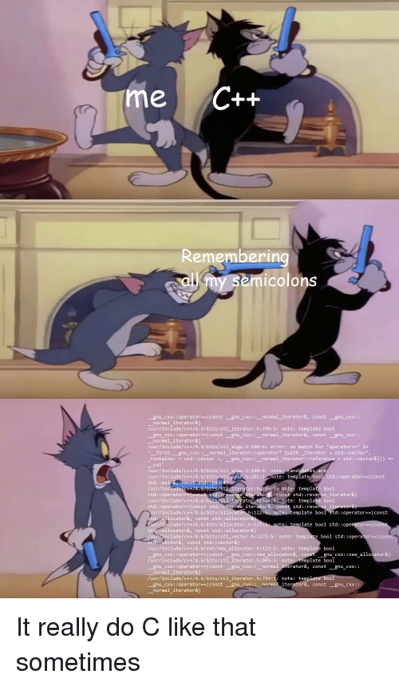

<center>
<h1>
In The Name Of ALLAH
</h1>
<h2>
STL -> C++ Standard Library
</h2>
<h3>
Description
</center>



# Introduction

In this homework we would have a simple exercise of **STL** in C++ and a simple start in Python.

# C++

After seeing how STL can make our lives easy, we've decided to do some usual tasks of our university by STL. So we need **Student** class with the following description.

```c++
class Student{
    public:
        long id{};
        double avg{};
        size_t units{50};
        Student (long _id, double _avg, size_t _units);
};
```

Based on the application, we would need to use vector, deque or list as our container. So, `convert` function would convert containers for us. In other words, this function creates a new container with our desired type from an existing container. You can see gtests for its usage.

You must implement the following functions too:

- `show`

  This function can accept any of the mentioned containers as argument and shows them like the following.

```c++
Student s1 {9423013, 18.2, 26};
Student s2 {9423037, 19.2, 30};
Student s3 {9423091, 19.1, 10};
std::deque<Student> d {s1, s2, s3};
std::vector<Student> v {convert<std::vector<Student>>(d)};
std::list<Student> l {convert<std::list<Student>>(d)};
show(d);
show(v);
show(l);
```

The output should be


- `findRank`

  This function gets a container and a number _n_ and returns the n'th student based on averages. You can see it's behavior in gtests.

- `getRanks`

  This function gets a container and sort its students based on their averages and returns the container. So the first student of this sorted container would be the one with highest average.

- `getInterns`

  In orther to qualify students for the internship, we need to sort them based on their units in descending orther. We need this function for this purpose.

## Note

You are not allowed to use **any** loops (for, while, etc.) in this homework. Using a loop may cost you some points!
